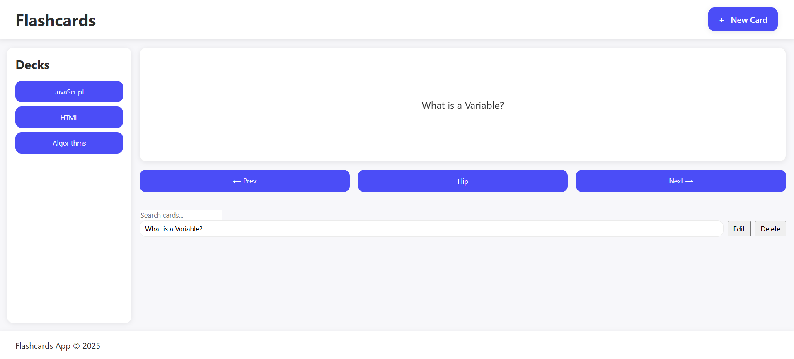

# Flashcards



## Description

A responsive, accessible flashcards application that allows users to create, edit, delete, search, and study custom flashcards. Cards are stored in the browser using localStorage so that data persists across page reloads. The app includes a 3D flip animation, keyboard navigation, and a modal interface for card creation.

## Table of Contents

- [Technologies Used](#technologiesused)
- [Features](#features)
- [Project Next Steps](#nextsteps)
- [Deployed App](#deployment)
- [About the Author](#author)
- [Reflection](#reflection)

## <a name="technologiesused"></a>Technologies Used

- JavaScript
- HTML5
- CSS3
- Cursor AI

## <a name="features"></a> Features

- Create, edit, delete flashcards
- Study mode with:
  - Flip animation
  - Previous / Next navigation
  - Shuffle mode
  - Keyboard shortcuts (Space, ←, →, Escape, S)
- Persistent storage using localStorage
- Debounced search (300ms) with match count
- Accessible modal with focus trap & ESC to close
- Responsive grid layout
- Uses CSS variables for theming

## <a name="nextsteps"></a>Project Next Steps

- Create multiple decks (separate card lists)
- Add “progress tracking” or spaced repetition
- Dark mode toggle using CSS variables
- Export / import flashcard sets
- Tagging and filtering by topic

## <a name="deployment"></a>Deployed Link

- Live Site:
  [Github Pages](https://cgxgb123.github.io/An-AI-Coding-Challenge/)

- You can view the repository here:
  [Github](https://github.com/cgxgb123/An-AI-Coding-Challenge)
- If unable to view please go live locally through VS Code

## <a name="author"></a>About The Author

Hi!. My name is **Christian Blunt** and i’m an aspiring technologist and problem-solver with a passion for creating intuitive applications that blend functionality with real-world purpose. My work is driven by curiosity. Whether I’m building tools inspired by global data, automating workflows, or developing small projects tied to my personal interests, I enjoy exploring how technology can make everyday experiences easier and more efficient.

## <a name="reflection"></a>Reflection:

- ## <a name="reflection"></a> Reflection (5 bullets)

- **Where AI saved time:**  
  AI generated the first working version of a modal focus trap and debounced search, which saved hours of trial-and-error around keyboard accessibility and real-time filtering performance.

- **AI bug identified & fixed:**  
  AI added duplicate `keydown` listeners when switching into study mode, causing the card to flip twice per key press. The fix was calling `exitStudyMode()` at the start of `enterStudyMode()` to remove previous listeners.

- **Code snippet refactored for clarity:**  
   Originally:

  ```js
  studySession.order = shuffleArray(studySession.order);
  studySession.index = 0;
  renderStudyCard(0);
  ```

  Refactored to:

  ```js
  studySession.order = shuffleArray([...Array(cards.length).keys()]);
  studySession.index = 0;

  renderStudyCard(0);
  ```

Making the intent explicit and removing mutation confusion.

**Accessibility improvement added:**  
Added proper `aria-label` attributes to interactive buttons (Flip, Prev, Next, New Card, and modal controls), ensuring all controls are discernible to screen readers and keyboard-only users without altering the visible UI.

**Prompt change that improved AI output:**  
Switching from “generate study mode logic” to “ensure enterStudyMode cleans up listeners and prevents memory leaks” gave AI a more precise objective and stopped it from producing unstable event-handling code.
